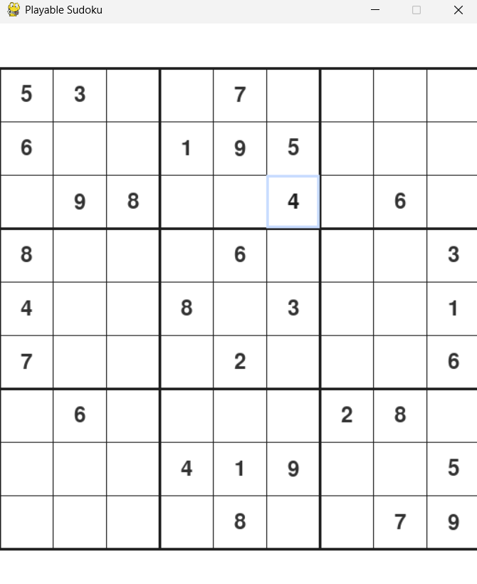
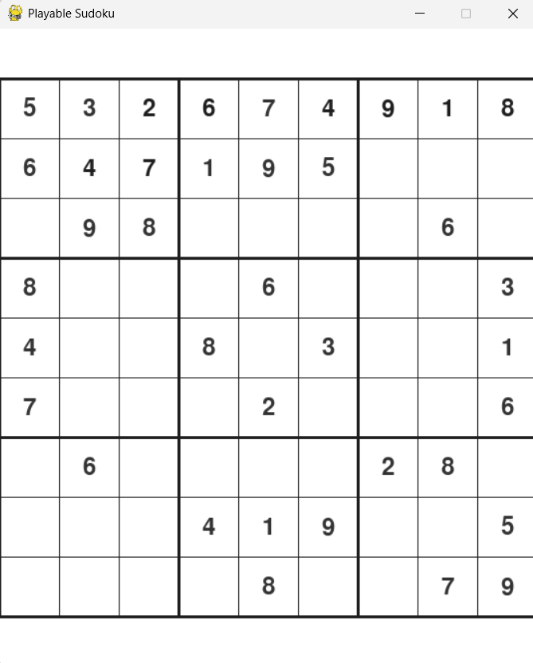

# 🧩 Sudoku Game

A **playable Sudoku game** built with **Python and Pygame**, combining manual gameplay with an **AI-powered DFS backtracking solver**.

You can play the puzzle yourself or press a key to watch the algorithm solve it step by step.

---

## ✨ Features

- 🎮 Fully playable Sudoku board
- 🖱️ Click cells and enter numbers (1–9)
- ❌ Fixed cells cannot be edited
- ⌫ Clear cells using Backspace / Delete
- 🤖 Auto-solve using DFS + Backtracking
- 🔁 Reset puzzle anytime
- 🧠 Visualized solving process
- 🪶 Clean, beginner-friendly codebase

---

## 🎮 Controls

| Action | Input |
|------|------|
| Select cell | Mouse click |
| Enter number | `1 – 9` |
| Clear cell | `Backspace` / `Delete` |
| Auto-solve puzzle | `SPACE` |
| Reset puzzle | `R` |
| Quit game | `ESC` |

---

## 📸 Screenshots

> Gameplay and solver visualization

<p align="center">
  
  
</p>

---

## 🧠 Algorithm Used

The solver uses **Depth-First Search (DFS)** with **backtracking**:

- Tries values from 1 to 9
- Validates each move
- Backtracks when a conflict occurs
- Continues until the puzzle is solved

The solving process is visualized in real time.

---

## 🛠️ Tech Stack

- **Python 3**
- **Pygame**
- DFS + Backtracking Algorithm

---

## 📂 Project Structure

sudoku_game/
│
├── main.py # Game loop & event handling
├── sudoku_board.py # Board logic & validation
├── sudoku_solver.py # DFS backtracking solver
├── sudoku_visualizer.py # Rendering & UI
├── puzzles.py # Predefined puzzles
├── constants.py # UI constants
├── screenshots/ # Gameplay images
│ ├── gameplay.png
│ └── solver.png
├── banner.png # README banner
└── README.md


---

## 🚀 How to Run

### 1️⃣ Install dependencies
```bash
pip install pygame

2️⃣ Run the game
python main.py


Make sure you run the command from the project folder.

📌 Why This Project?

This project was built to:

Practice algorithm visualization

Learn event-driven game programming

Combine manual gameplay with AI-assisted solving

Create a clean, portfolio-ready Python project

📜 License


This project is licensed under the MIT License.


